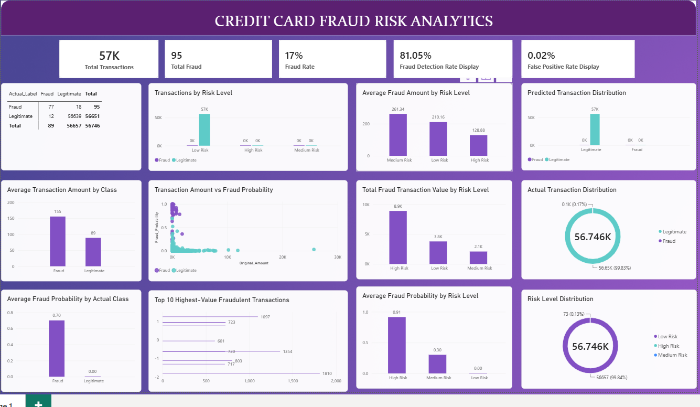

# Credit Card Fraud Detection & Risk Analytics

An end-to-end machine learning and analytics project for detecting fraudulent credit card transactions, evaluating model performance, segmenting transaction risk, and presenting business-oriented insights through PostgreSQL and Power BI.

## 📌 Project Overview

Credit card fraud detection is a highly imbalanced classification problem where fraudulent transactions represent a very small proportion of total transactions.

This project combines:

- Exploratory Data Analysis
- Data preprocessing
- Machine Learning
- Class imbalance handling with SMOTE
- Probability threshold optimization
- SHAP explainability
- PostgreSQL analysis
- Power BI dashboarding

The objective was to build a fraud detection workflow that balances fraud detection with false-positive control while providing interpretable risk analytics.

## 📊 Dataset

The project uses the **European Credit Card Fraud Detection** dataset.

After duplicate removal, the analysis contained:

- **283,726 transactions**
- **473 fraudulent transactions**
- **283,253 legitimate transactions**

The dataset contains:

- `Time`
- `V1`–`V28`
- `Amount`
- `Class`

`V1`–`V28` are anonymized PCA-transformed features and therefore are not assigned specific business meanings.

## 🔍 Exploratory Data Analysis

The analysis examined:

- Transaction distributions
- Fraud vs legitimate transactions
- Class imbalance
- Transaction amounts
- Fraud probability
- Model predictions
- False positives and missed fraud
- Risk-level segmentation

## 🤖 Machine Learning

Two classification approaches were evaluated:

- Logistic Regression
- Random Forest

Class imbalance was addressed using:

- `class_weight='balanced'`
- SMOTE applied to the training data

Probability threshold optimization was also performed to improve the balance between precision and fraud detection.

The selected operating threshold was **0.20**.

## 📈 Model Performance

Final model performance:

| Metric | Result |
|---|---:|
| Precision | **86.52%** |
| Fraud Detection Rate / Recall | **81.05%** |
| F1 Score | **83.70%** |
| ROC-AUC | **93.91%** |
| PR-AUC | **80.12%** |

The model correctly detected **77 of 95 actual fraudulent transactions** in the test set, while **18 fraudulent transactions were missed**.

## 🧠 Model Explainability

SHAP was used to understand which anonymized features contributed most strongly to model predictions.

Top features by SHAP importance included:

1. V14
2. V12
3. V4
4. V3
5. V10
6. V11
7. V17
8. V16
9. V7
10. V2

Because the dataset features are anonymized PCA components, these feature names are reported without assigning unsupported business interpretations.

## 🗄️ PostgreSQL Analytics

Model predictions were loaded into PostgreSQL for further analysis.

SQL analysis covered:

- Actual fraud vs legitimate transactions
- Fraud detection rate
- False-positive rate
- Missed fraud
- Average transaction amounts
- Fraud probability
- Highest-value fraudulent transactions
- Highest fraud-probability transactions
- Risk-level classification
- Fraud rate by risk level
- Confusion matrix
- Detected fraudulent transaction value
- Fraud value by risk level
- High-value vs normal-value transactions

## ⚠️ Risk Segmentation

Transactions were classified using fraud probability:

| Fraud Probability | Risk Level |
|---|---|
| `< 0.20` | Low Risk |
| `0.20 – < 0.50` | Medium Risk |
| `≥ 0.50` | High Risk |

This provides a business-friendly way to prioritize transactions for investigation.

## 📊 Power BI Dashboard

The Power BI dashboard provides an interactive view of fraud detection and transaction risk.

Key dashboard areas include:

- Total transactions
- Total fraud
- Fraud rate
- Fraud detection rate
- False-positive rate
- Confusion matrix
- Actual transaction distribution
- Predicted transaction distribution
- Risk-level distribution
- Average transaction amount
- Average fraud amount
- Fraud probability
- Highest-value fraudulent transactions
- Fraud transaction value by risk level
- Precision vs Recall

## 🛠️ Technologies Used

**Programming & Machine Learning**
- Python
- Pandas
- NumPy
- Scikit-learn
- Imbalanced-learn
- SHAP
- Jupyter Notebook

**Database & Analytics**
- PostgreSQL
- SQL
- SQLAlchemy

**Visualization & BI**
- Power BI
- DAX

**Development Tools**
- VS Code
- Git
- GitHub

## 📊 Power BI Dashboard



## 📁 Project Files

```text
├── fraud_detection.ipynb
├── fraud_predictions_sample.csv
├── feature_importance.csv
├── model_metrics.csv
└── shap_feature_importance.csv


